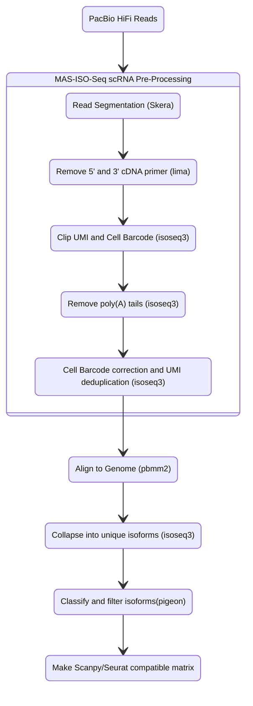

```mermaid
%%{init: {'theme': 'default', 'themeVariables': { 'fontSize': '10px', 'fontFamily': 'Arial'}}}%%
stateDiagram-v2
  state "PacBio HiFi Reads" as start
	state "MAS-ISO-Seq scRNA Pre-Processing" as isoseq3
	state "Read Segmentation (Skera)" as rs
	state "Remove 5' and 3' cDNA primer (lima)" as rmvprimer
	state "Clip UMI and Cell Barcode (isoseq3)" as clipumicbc
	state "Remove poly(A) tails (isoseq3)" as rmvpolya
	state "Cell Barcode correction and UMI deduplication (isoseq3)" as cbccorrect_umidedup
	state "Align to Genome (pbmm2)" as align
	state "Collapse into unique isoforms (isoseq3)" as collapseisoforms
	state "Classify and filter isoforms(pigeon)" as classfiltisoforms
	state "Make Scanpy/Seurat compatible matrix" as scanpy
	start --> isoseq3
	direction TB
	state isoseq3 {
		rs --> rmvprimer
		rmvprimer --> clipumicbc
    clipumicbc --> rmvpolya
    rmvpolya --> cbccorrect_umidedup
}
		cbccorrect_umidedup --> align
		align --> collapseisoforms
		collapseisoforms --> classfiltisoforms
		classfiltisoforms --> scanpy
```